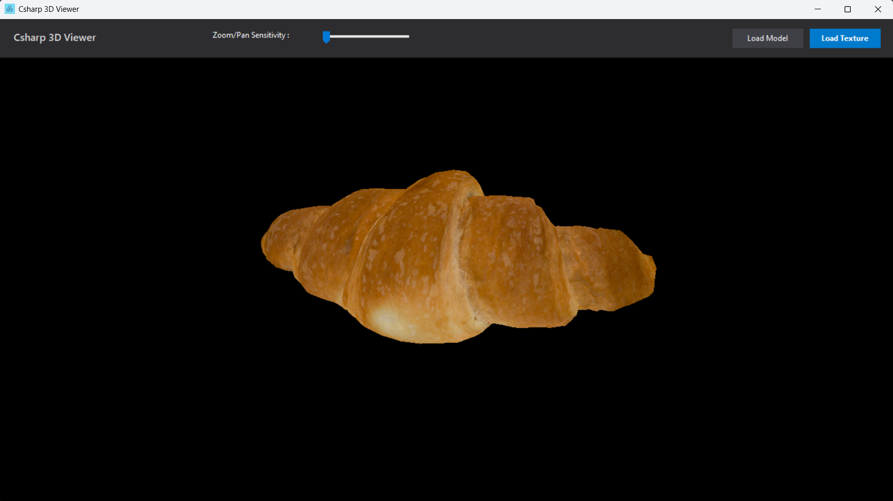
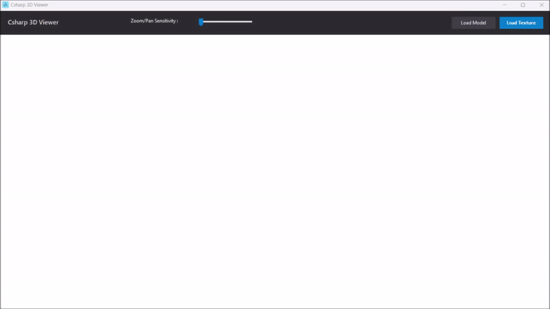
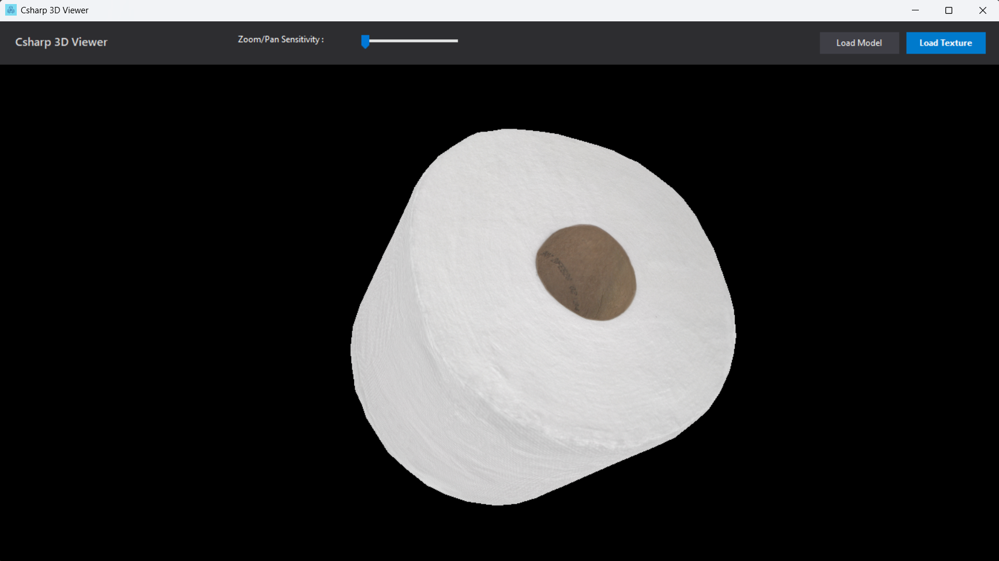
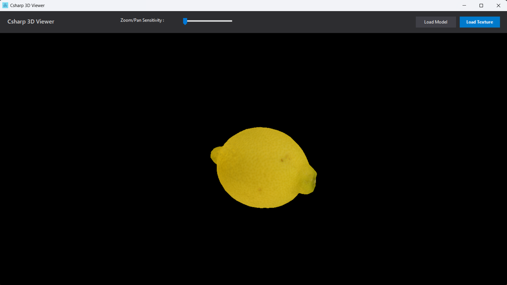
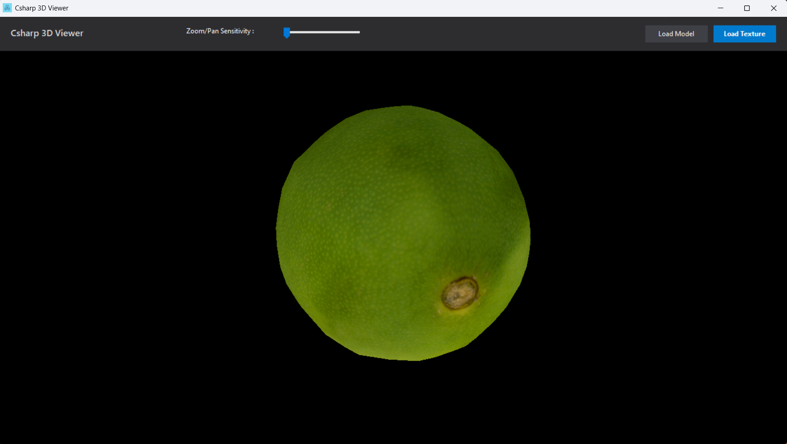

# Csharp-3D-Viewer

A lightweight 3D model viewer built with **C#**, **WinForms**, and **OpenTK (OpenGL)**. This application allows users to load, visualize, and interact with 3D models.

## 🚀  Features

* **Multi-Format Support**: Load .obj, .fbx, and .stl files seamlessly.

* **Real-time Rendering:** Powered by OpenGL (OpenTK) for smooth performance.

* **Interactive Camera:**

  **-Rotation:** Left-click and drag.

  **-Panning:** Right-click and drag.

  **-Zooming:** Mouse wheel support.

* **Dynamic Sensitivity:** Adjustable control sensitivity (zoom and pan) via a built-in trackbar for precision or fast movement.

* **Texture Mapping:** Apply image textures (.jpg, .png, .bmp) to your 3D models.

* **Lighting System:** Built-in ambient and diffuse lighting to enhance model depth.

## 🛠 Tech Stack

* **Language:** C#

* **Framework:** .NET Framework 4.8.1

* **Graphics API:** OpenGL via OpenTK

* **Model Loading:** AssimpNet

## 📸 Screenshots
* Loading model and texture, than Zooming/Panning/Rotation.

* There are some screenshots for 3D models in the "Examples" folder.

	
## ⚙️ Installation & Usage

**1. Clone the repository:**
    Bash

    git clone https://github.com/mertusta1996/Csharp-3D-Viewer.git

**2. Open the Solution:** Open Csharp3DViewer.sln in Visual Studio.

**3. Restore NuGet Packages:** Ensure OpenTK, OpenTK.GLControl and Assimpnet are installed.

**4. Run:** Press F5 to build and run the application.

## 📂 Project Structure

* /Controller: Contains logic for camera movement and model handling.

* /View: Contains the MainForm and OpenGL control UI.

* /Model: Represents the data state of the 3D application, including the 3D mesh data, scene, texture id, and transformation vectors.

* /Examples: Sample 3D models and textures.

## 🤝 Contributing

Contributions, issues, and feature requests are welcome! Feel free to check the issues page.

## Author
- Mert Usta
- https://sketchfab.com/inciprocal.com (added Example 3D models from this source)
